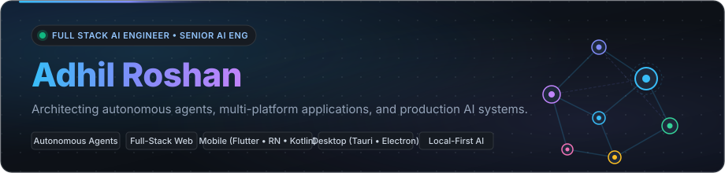

 

  
  
  
  
  

---

### Featured Systems

  
  

  
  

  
  

---

### Technical Focus

  LANGUAGES &amp; RUNTIMES 
  

  WEB &amp; FULL-STACK ECOSYSTEM 
  

  MOBILE &amp; DESKTOP PLATFORMS 
  

  AI, DATA &amp; INFRASTRUCTURE 
  

---

### Engineering Activity &amp; Streak

<!--START_SECTION:worklog-->
Current streak: 11 days · Longest: 11 days

<!--END_SECTION:worklog-->
