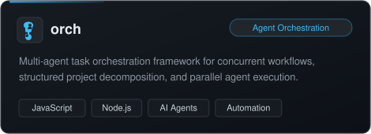
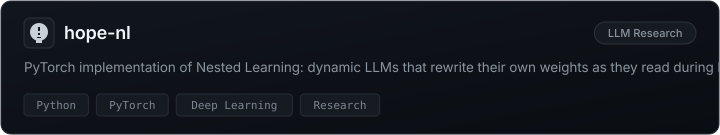
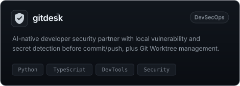
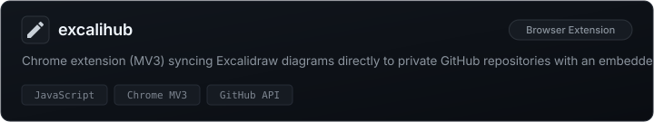
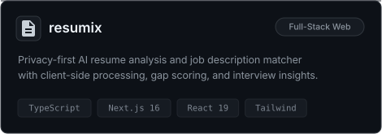
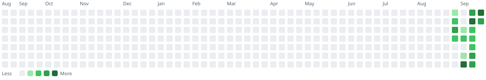

# <a href="https://adhilroshan.in">Adhil Roshan</a>

  <b>Full Stack AI Engineer</b> &nbsp;•&nbsp; 
  <b>Senior AI Engineer @ Cybroque Technologies</b> &nbsp;•&nbsp; 
  <b>Autonomous Agents & Multi-Platform Systems</b>

  
  
  
  
  

  

---

### Featured Projects

  
  

  
  

  
  

---

### Tech Arsenal

  <b>Languages & Core</b> 
  

  <b>Web & Full-Stack Ecosystem</b> 
  

  <b>Mobile & Desktop Platforms</b> 
  

  <b>AI, Data & Cloud Stack</b> 
  

---

### Coding Activity & Streak

<!--START_SECTION:worklog-->
Current streak: 11 days · Longest: 11 days

<!--END_SECTION:worklog-->

---

Crafted with passion for autonomous agents, high performance, and great software.

