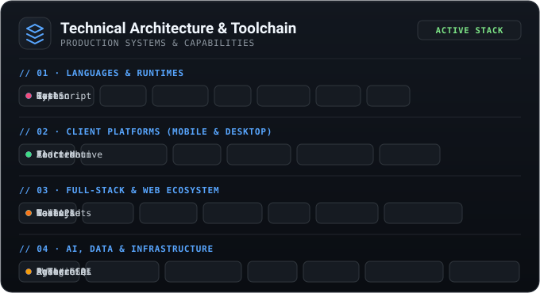

 

  
  
  
  
  

---

### Featured Systems

  

  

  

  

  

  

---

### Technical Focus

  

---

### Engineering Activity &amp; Streak

<!--START_SECTION:worklog-->
Current streak: 11 days · Longest: 11 days

<!--END_SECTION:worklog-->
